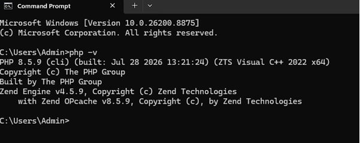
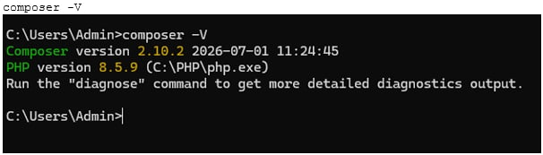
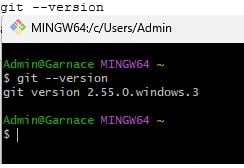
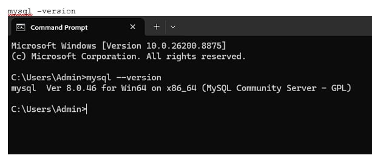
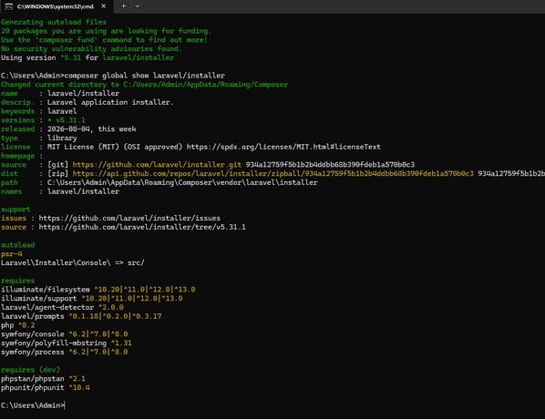

# Laravel Installation and Environment Setup

## 1. Project Title

**Setting Up a Laravel Development Environment: A Hands-On Guide to Client-Server Web Development**

Prepared by: Bryan Garnace
Course/Section: BSIT-3B
Date: August 7, 2026

---

## 2. Introduction

### Brief Overview of Laravel
Laravel is a free, open-source PHP web application framework created by Taylor Otwell and first released in 2011. It follows the Model-View-Controller (MVC) architectural pattern and is designed to make common web development tasks — such as routing, authentication, sessions, and caching — easier and more expressive. Laravel provides an elegant syntax, a powerful command-line tool called Artisan, and a rich ecosystem of packages (e.g., Eloquent ORM, Blade templating engine, and Laravel Sanctum) that streamline the process of building modern, secure, and maintainable web applications.

### Importance of Client-Server Technologies
Client-server technology is the foundation of how most modern applications operate on the web. In this model, the **client** (typically a web browser or mobile app) sends requests to a **server**, which processes those requests, interacts with a database if needed, and returns a response. Understanding this architecture is essential for developers because it clarifies how data flows between the user interface and the backend logic, how requests are routed and handled, and how security, scalability, and performance considerations come into play. Frameworks like Laravel simplify the server-side portion of this model, allowing developers to focus on business logic rather than repetitive infrastructure code.

### Purpose of the Project
The purpose of this project/activity is to install and configure a complete Laravel development environment, understand its folder structure, and gain hands-on experience with the tools required for PHP-based web development. This activity also aims to build foundational skills in client-server architecture by exploring how Laravel handles requests, routes, and responses.

---

## 3. Objectives

By the end of this activity, the following objectives were achieved:

1. Successfully installed and configured all prerequisite software (PHP, Composer, Git, MySQL) required to run a Laravel application.
2. Installed Laravel via Composer and created a new Laravel project from scratch.
3. Verified the development environment by running the Laravel local development server and accessing the default welcome page in a browser.
4. Explored and understood the purpose of Laravel's core directory structure (`app/`, `routes/`, `resources/`, `public/`, `config/`, `database/`).
5. Identified and resolved common installation and configuration issues encountered during setup.
6. Gained a practical understanding of how client-server communication works within the Laravel framework.

---

## 4. Development Environment

| Component | Version / Details |
|---|---|
| Operating System | Windows 11, 64-bit (Build 10.0.26200) |
| PHP Version | PHP 8.5.9 (cli) (ZTS Visual C++ 2022 x64) |
| Laravel Version | laravel/installer v5.31.1 [confirm framework version with `php artisan --version` inside the project] |
| Composer Version | Composer 2.10.2 |
| Git Version | 2.55.0.windows.3 |
| MySQL Version | 8.0.46 (MySQL Community Server – GPL) |
| VS Code Version | VS Code 1.101.2 |

---

## 5. Installation Steps

Below is a step-by-step guide to setting up the Laravel development environment. Screenshots are included for each major step.

### Step 1: Install PHP
1. Download PHP from the [official PHP website](https://www.php.net/downloads) or via a stack like XAMPP/Laragon.
2. Add PHP to the system's environment PATH variable.
3. Verify installation by running `php -v` in the terminal.


*Figure 1. PHP version confirmed via `php -v` in the terminal.*

### Step 2: Install Composer
1. Download Composer from the [official Composer website](https://getcomposer.org/download/).
2. Run the installer and ensure it links to the correct PHP executable.
3. Verify installation by running `composer -V`.


*Figure 2. Composer version confirmed via `composer -V` in the terminal.*

### Step 3: Install Git
1. Download Git from the [official Git website](https://git-scm.com/downloads).
2. Complete the installation using default settings (or preferred configuration).
3. Verify installation by running `git --version`.


*Figure 3. Git version confirmed via `git --version` in the terminal.*

### Step 4: Install MySQL
1. Download MySQL Community Server or install via a bundled stack (XAMPP, Laragon, WAMP).
2. Start the MySQL service.
3. Verify installation by running `mysql --version` or connecting via MySQL Workbench.


*Figure 4. MySQL version confirmed via `mysql --version` in the terminal.*

### Step 5: Install Laravel via Composer
1. Open a terminal and navigate to the desired project directory.
2. Run the following command to create a new Laravel project:
   ```bash
   composer create-project laravel/laravel example-app
   ```
3. Wait for Composer to download and install all dependencies.


*Figure 5. Laravel installer version confirmed via `composer global show laravel/installer`.*

### Step 6: Run the Laravel Development Server
1. Navigate into the project folder:
   ```bash
   cd example-app
   ```
2. Start the built-in development server:
   ```bash
   php artisan serve
   ```
3. Open a browser and go to `http://127.0.0.1:8000` to view the default Laravel welcome page.

**[Insert Screenshot Here: Laravel welcome page in browser]**

### Step 7: Open the Project in VS Code
1. Open VS Code.
2. Use `File > Open Folder` and select the Laravel project directory.
3. Install recommended extensions (e.g., PHP Intelephense, Laravel Blade Snippets).

**[Insert Screenshot Here: Laravel project opened in VS Code]**

---

## 6. Project Structure

Laravel follows a well-organized directory structure that separates concerns and makes applications easier to maintain. Below are explanations of the most important folders:

- **`app/`** — Contains the core application code, including Models, Controllers, and Middleware. This is where most of the business logic resides, following the MVC pattern.

- **`routes/`** — Defines how the application responds to client requests. The `web.php` file handles routes for the browser-based interface, while `api.php` handles routes intended for API consumption.

- **`resources/`** — Holds the raw, uncompiled front-end assets such as Blade view templates (`.blade.php`), CSS, JavaScript, and language files. This is where the presentation layer (what the client sees) is built.

- **`public/`** — The web server's document root and the only folder directly accessible from the browser. It contains the `index.php` entry point, along with compiled CSS/JS assets and other public files like images.

- **`config/`** — Contains all configuration files for the application, such as database connections, mail settings, caching, and session behavior. These files allow developers to customize Laravel's behavior without touching core code.

- **`database/`** — Contains database migrations, seeders, and factories. Migrations define the database schema in code, seeders populate the database with sample data, and factories help generate fake data for testing.

---

## 7. Problems Encountered

At least three challenges were experienced during installation:

1. **Composer not recognized as a command** — After installing Composer, running `composer` in the terminal returned an error stating the command was not recognized.
2. **PHP PATH issue** — Running `php -v` in the terminal resulted in an error indicating that PHP was not recognized as an internal or external command.
3. **MySQL service not starting** — The MySQL service failed to start, preventing the database connection from being established when running the Laravel application.

*(Replace or add to these based on your actual experience.)*

---

## 8. Solutions

1. **Composer not recognized:**
   The issue was resolved by manually adding the Composer installation directory to the system's environment PATH variable, then restarting the terminal (and computer, if necessary) so the changes would take effect.

2. **PHP PATH issue:**
   This was fixed by locating the PHP installation folder and manually adding its path to the system's environment variables (`Path` under System Variables on Windows). After updating the PATH, the terminal was restarted, and `php -v` successfully returned the installed version.

3. **MySQL service not starting:**
   The problem was traced to a port conflict with another application using port 3306. This was resolved by either stopping the conflicting service or changing MySQL's configured port in the `my.ini` file, then restarting the MySQL service through the XAMPP/Laragon control panel (or Windows Services).

*(Update these explanations to reflect the actual solutions you applied.)*

---

## 9. Screenshots

**Figure 1.** PHP version verified successfully in the terminal.


**Figure 2.** Composer installed and version confirmed.


**Figure 3.** Git installation verified via terminal command.


**Figure 4.** MySQL service running and version confirmed.


**Figure 5.** Laravel installer version confirmed via Composer.


**Figure 6.** Laravel welcome page displayed after running `php artisan serve`.
**[Insert Screenshot — see note below]**

**Figure 7.** Laravel project structure opened in VS Code.
**[Insert Screenshot]**

---

## 10. Reflection

*(300–500 words. The draft below is a starting point — personalize it with your own experience, then check the final word count before submitting.)*

Completing this Laravel installation activity gave me a much deeper appreciation for what happens "under the hood" before a single line of application code is even written. I learned that setting up a proper development environment is not a trivial task — it requires several interdependent tools (PHP, Composer, Git, and MySQL) to be installed correctly and configured to work together. I also learned how Laravel's directory structure is intentionally organized to separate concerns: routes define how requests are received, controllers and models in the `app/` folder handle logic and data, Blade views in `resources/` control what the client sees, and the `public/` folder acts as the single gateway between the outside world and the application. Understanding this structure made the abstract concept of "MVC architecture" much more concrete.

The most significant challenges I encountered were related to environment configuration rather than Laravel itself. PATH-related issues with PHP and Composer were particularly frustrating because the error messages did not always clearly indicate the root cause, and I initially assumed the software was not installed correctly rather than realizing it was a PATH configuration issue. Troubleshooting the MySQL service failure also taught me the importance of checking for port conflicts and reading service logs rather than immediately reinstalling software. These experiences reinforced the value of patience and systematic debugging — checking one variable at a time instead of changing multiple settings simultaneously.

Laravel's importance in client-server development became clear once I saw the framework in action. It elegantly abstracts many of the repetitive tasks involved in handling HTTP requests, communicating with a database, and rendering dynamic content back to the client. Laravel's routing system directly reflects the client-server request-response cycle: a client sends a request to a specific route, the corresponding controller processes it, and a response — often rendered through a Blade view — is sent back. Seeing this cycle in practice helped me understand not just Laravel, but the broader principles that apply to virtually all modern web frameworks, including those built on Node.js, Django, or ASP.NET.

This knowledge will be valuable in future software development projects because environment setup and framework fundamentals are foundational skills that transfer across projects and even across different technology stacks. Knowing how to properly configure a development environment, troubleshoot PATH and service issues, and understand an MVC-based project structure will save time on future projects and reduce reliance on trial-and-error. More importantly, understanding the client-server model at a practical level — not just theoretically — will help me design more efficient, secure, and maintainable applications going forward, whether I continue working with Laravel or move on to other frameworks that follow similar architectural principles.

*(Word count: adjust as needed to stay within 300–500 words.)*

---

## 11. References

*(APA 7th Edition format)*

Composer. (n.d.). *Composer documentation*. Composer. https://getcomposer.org/doc/

Git. (n.d.). *Git documentation*. Git. https://git-scm.com/doc

Laravel. (n.d.). *Laravel documentation*. Laravel. https://laravel.com/docs

PHP Group. (n.d.). *PHP manual*. PHP. https://www.php.net/manual/en/

*(Add any additional sources you used, such as MySQL documentation, VS Code documentation, or tutorial videos, following the same APA 7th Edition format.)*
